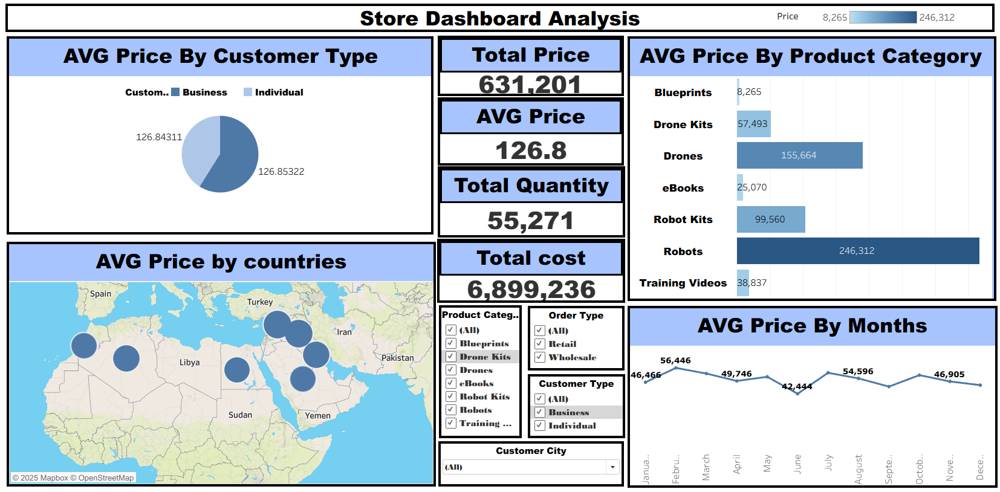

# Store Dashboard Analysis | Sales & Price Metrics

## 📊 Project Overview
This repository contains the source files for the **Store Dashboard Analysis**, a powerful **Tableau** data visualization tool designed to monitor and analyze key sales metrics, focusing primarily on **Average Price**, **Total Price**, and **Total Quantity** across various dimensions.

The dashboard provides management with essential insights into pricing strategy, customer behavior, product performance, and geographical sales distribution.

---

## 📸 Dashboard Snapshot

To get a quick look at the analysis:



---

## 🎯 Key Metrics & Insights

The dashboard focuses on several high-level Key Performance Indicators (KPIs) and detailed breakdowns:

### High-Level Metrics
| Metric | Value |
| :--- | :--- |
| **Total Price** | 631,201 |
| **AVG PRICE** | 126.8 |
| **Total Quantity** | 55,271 |
| **Total Cost** | 6,899,236 |

### 1. AVG Price By Customer Type
* **Insight:** The average price paid by **Business** customers (approx. 126.84) is slightly lower than that paid by **Individual** customers (approx. 126.85). This suggests a consistent pricing structure or minimal bulk discounts.

### 2. AVG Price By Product Category
* **Key Finding:** **Robots** dominate the total price value (246,312), followed by **Drones** (155,664) and **Robot Kits** (99,660).
* **Lowest Price:** **Blueprints** show the lowest total price value (8,265).

### 3. AVG Price by Countries (Geographical Analysis)
* **Insight:** The map highlights key sales territories, primarily focused in the **Middle East** and **Mediterranean** regions, including Spain, Turkey, Libya, Sudan, Yemen, and Iran. This visual helps identify high-volume sales locations.

### 4. AVG Price By Months (Time-Series Analysis)
* **Trend:** The average price fluctuates throughout the year. The highest average price occurred in **August** (54,596), while the lowest was in **May** (42,444). This time-series view is crucial for pricing reviews.

---
## 🛠️ Technology Stack
* **Tool:** **Tableau Desktop** (or Tableau Public/Server for viewing)
* **File Type:** `.twb` (Tableau Workbook)
* **Data Source:** Likely a transaction or sales ledger database (CSV, SQL).

---

## 🚀 Getting Started

To view and interact with this dashboard:


### Installation & Setup
1.  **Clone the repository:**
    ```bash
    git clone [https://github.com/mohammedsarhan4085-bit/Store-Dashboard-Analysis.git](https://github.com/mohammedsarhan4085-bit/Store-Dashboard-Analysis.git)
    cd Store-Dashboard-Analysis
    ```
2.  **Open the Source File:** Open the Tableau workbook file (e.g.`Store_Analysis.twb`) using Tableau Desktop.

---

## 📝 Filters & Interactivity

The dashboard includes several interactive slicers/filters for detailed analysis:

* **Product Category:** Filter by specific items (Blueprints, Drone Kits, Robots, etc.).
* **Order Type:** Filter by Retail or Wholesale orders.
* **Customer Type:** Filter by Business or Individual customers.
* **Customer City:** Filter the data to a specific city.

---

## 📄 License
This project is licensed under the MIT License.
